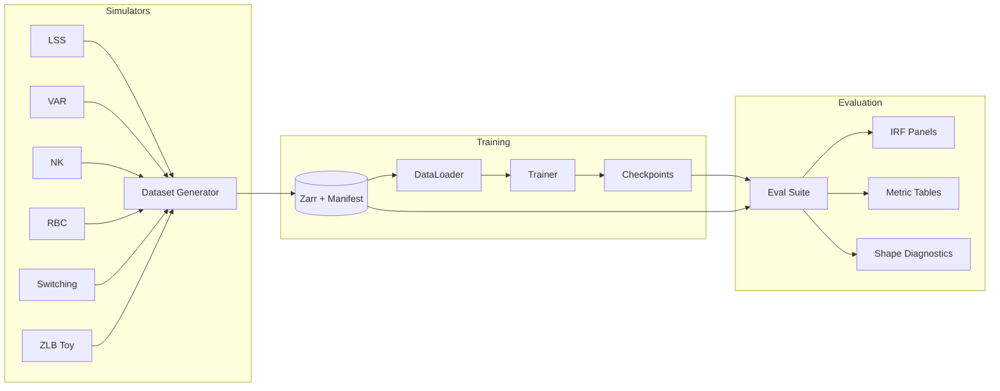
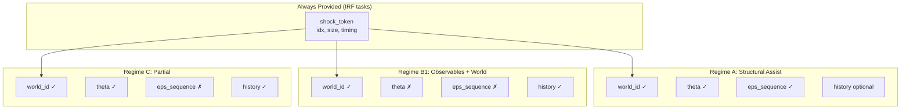
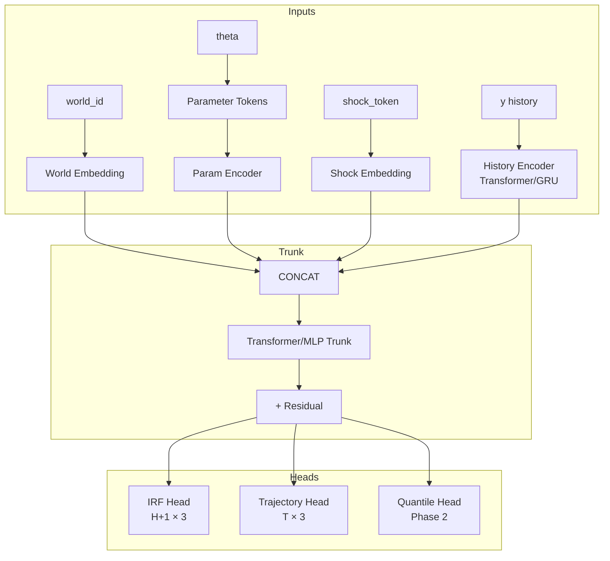
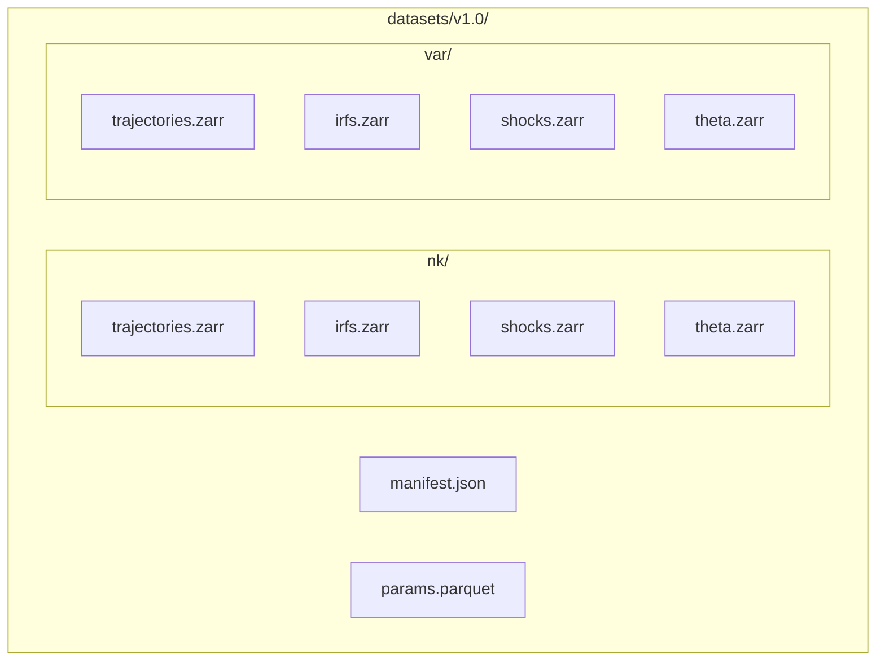

# Universal Macro Emulator Specification

**Version:** 1.0.0
**Status:** Draft
**Last Updated:** 2025-12-23

---

## Table of Contents

1. [Overview](#1-overview)
2. [Requirements](#2-requirements)
3. [Simulator Interface](#3-simulator-interface)
   - 3.5 [IRF Conventions](#35-irf-conventions)
   - 3.6 [Canonical Observable Contract](#36-canonical-observable-contract)
   - 3.7 [Parameter and Shock Normalization](#37-parameter-and-shock-normalization)
4. [Data Schema](#4-data-schema)
   - 4.6 [Split Construction Algorithms](#46-split-construction-algorithms)
5. [Emulator Architecture](#5-emulator-architecture)
   - 5.5 [Training Objective](#55-training-objective)
6. [Information Regimes](#6-information-regimes)
   - 6.1 [Shock Input Decomposition](#61-shock-input-decomposition)
7. [Evaluation Framework](#7-evaluation-framework)
   - 7.2 [Success Criteria (Mathematical)](#72-success-criteria)
8. [Testing Strategy](#8-testing-strategy)
   - 8.4 [Test Markers (Fast vs Slow)](#84-test-markers-fast-vs-slow)
9. [Sprint Plan](#9-sprint-plan)
10. [Non-Goals](#10-non-goals)
11. [Appendices](#appendix-a-glossary)
    - A: Glossary
    - B: Simulator Parameter Summaries (all 6 simulators)
    - C: Architecture Diagrams (Mermaid)
    - D: File Structure
    - E: Experiment Tracking

---

## 1. Overview

### 1.1 Purpose

The Universal Macro Emulator is a neural network that learns to predict impulse response functions (IRFs) and trajectories across a diverse bank of macroeconomic simulators. Given world parameters, shock specifications, and optional history, it produces forecasts that generalize across model families.

### 1.2 Core Prediction Task

**Inputs:**
- `world_id`: Identifier for the simulator (optionally latent at test time)
- `theta`: World parameters (structural coefficients)
- `shock_spec`: Shock type, size, timing, and/or full sequence `eps[0:T]`
- `x0` / `y[0:k]`: Initial state or observable history

**Outputs:**
- **IRFs:** `y[h]` for horizons `h = 0..H` (default `H = 40`)
- **Trajectories:** `y[t]` for `t = 1..T` (multi-step rollouts)
- **Phase 2:** Uncertainty quantification, latent world embeddings

### 1.3 Design Principles

1. **Model-agnostic interface:** Simulators conform to a strict adapter API
2. **Diversity by construction:** Simulator bank spans linear/nonlinear, regime-switching, forward/backward-looking, occasionally-binding constraints
3. **Separation of concerns:** Simulator code, dataset generation, training, and evaluation are modular
4. **Hard gates:** No sprint complete without automated tests + evaluation artifacts + reproducible run command

---

## 2. Requirements

### 2.1 Functional Requirements

| ID | Requirement | Priority |
|----|-------------|----------|
| FR-1 | Generate IRFs for horizons 0..40 (configurable to 80) | Must |
| FR-2 | Generate trajectories for T ∈ {40, 120, 200} | Must |
| FR-3 | Support 6 Phase-1 simulators via uniform adapter API | Must |
| FR-4 | Produce 3 canonical observables (output, inflation, rate) for all simulators | Must |
| FR-5 | Support information regimes A, B1, C (see §6) | Must |
| FR-6 | Deterministic, versioned dataset generation | Must |
| FR-7 | Reproducible training with single command | Must |
| FR-8 | Support up to 10 additional simulator-specific observables | Should |
| FR-9 | Uncertainty quantification (quantile heads) | Phase 2 |
| FR-10 | Latent world inference (no world_id) | Phase 2 |

### 2.2 Non-Functional Requirements

| ID | Requirement | Target |
|----|-------------|--------|
| NFR-1 | Universal emulator within 20% of per-world specialists | Must |
| NFR-2 | Universal emulator beats simple baselines (VAR, MLP) | Must |
| NFR-3 | Training completes on single A100 in < 24h | Should |
| NFR-4 | Inference < 100ms per IRF batch (size 32) | Should |
| NFR-5 | Dataset generation < 4h for 100k samples/simulator | Should |

---

## 3. Simulator Interface

### 3.1 Adapter API

All simulators must implement the `SimulatorAdapter` protocol:

```python
from abc import ABC, abstractmethod
from dataclasses import dataclass
import numpy as np

@dataclass
class ParameterManifest:
    """Metadata for simulator parameters."""
    names: list[str]              # Parameter names
    units: list[str]              # Physical units
    bounds: np.ndarray            # Shape: (n_params, 2) [lower, upper]
    defaults: np.ndarray          # Shape: (n_params,)
    priors: list[dict]            # Prior specifications (optional)

@dataclass
class ShockManifest:
    """Metadata for structural shocks."""
    names: list[str]              # Shock names (e.g., "monetary", "technology")
    n_shocks: int                 # Number of shock types
    sigma: np.ndarray             # Shape: (n_shocks,) - std dev of each shock
    default_size: float = 1.0     # Default shock size in std dev units

@dataclass
class ObservableManifest:
    """Metadata for observables."""
    canonical_names: list[str]    # Always ["output", "inflation", "rate"]
    extra_names: list[str]        # Simulator-specific (up to 10)
    n_canonical: int = 3
    n_extra: int = 0

@dataclass
class SimulatorOutput:
    """Output from a single simulation run."""
    y_canonical: np.ndarray       # Shape: (T, 3) - output, inflation, rate
    y_extra: np.ndarray | None    # Shape: (T, n_extra) or None
    x_state: np.ndarray | None    # Shape: (T, n_state) - internal state (optional)
    regime_seq: np.ndarray | None # Shape: (T,) - regime indicators (if applicable)

class SimulatorAdapter(ABC):
    """Base class for all simulator adapters."""

    @property
    @abstractmethod
    def world_id(self) -> str:
        """Unique identifier for this simulator."""
        pass

    @property
    @abstractmethod
    def param_manifest(self) -> ParameterManifest:
        """Parameter metadata."""
        pass

    @property
    @abstractmethod
    def shock_manifest(self) -> ShockManifest:
        """Shock metadata."""
        pass

    @property
    @abstractmethod
    def obs_manifest(self) -> ObservableManifest:
        """Observable metadata."""
        pass

    @abstractmethod
    def sample_parameters(self, rng: np.random.Generator) -> np.ndarray:
        """Sample valid parameters from prior. Shape: (n_params,)"""
        pass

    @abstractmethod
    def simulate(
        self,
        theta: np.ndarray,
        eps: np.ndarray,
        T: int,
        x0: np.ndarray | None = None,
    ) -> SimulatorOutput:
        """
        Run simulation.

        Args:
            theta: Parameters, shape (n_params,)
            eps: Shock sequence, shape (T, n_shocks)
            T: Number of time steps
            x0: Initial state (optional), shape (n_state,)

        Returns:
            SimulatorOutput with trajectories
        """
        pass

    @abstractmethod
    def compute_irf(
        self,
        theta: np.ndarray,
        shock_idx: int,
        shock_size: float,
        H: int,
        x0: np.ndarray | None = None,
    ) -> np.ndarray:
        """
        Compute impulse response function.

        Args:
            theta: Parameters
            shock_idx: Index of shock to perturb
            shock_size: Size of shock in std devs
            H: Horizon length
            x0: Initial state (optional)

        Returns:
            IRF array, shape (H+1, 3) for canonical observables
        """
        pass

    def validate_parameters(self, theta: np.ndarray) -> bool:
        """Check parameter validity (bounds, stability)."""
        bounds = self.param_manifest.bounds
        return np.all(theta >= bounds[:, 0]) and np.all(theta <= bounds[:, 1])

    def get_analytic_irf(
        self,
        theta: np.ndarray,
        shock_idx: int,
        shock_size: float,
        H: int,
    ) -> np.ndarray | None:
        """Return closed-form IRF if available (for oracle baseline)."""
        return None
```

### 3.2 Canonical Observable Mapping

Each simulator defines a measurement layer `C^canon` that maps internal state to canonical observables:

```
y_canon[t] = C^canon(theta) @ s[t] + eta[t]
```

Where `y_canon` has dimension 3: `[output, inflation, rate]`.

| Simulator | Output | Inflation | Rate |
|-----------|--------|-----------|------|
| NK | Output gap | Inflation | Nominal rate |
| RBC | Log output deviation | First state derivative (scaled) | Return on capital |
| VAR | Variable 1 | Variable 2 | Variable 3 |
| LSS | Observation 1 | Observation 2 | Observation 3 |
| Switching | State 1 | State 2 | State 3 |
| ZLB Toy | Output gap | Inflation | Constrained rate |

### 3.3 Phase-1 Simulator Bank

| Simulator | Description | Params | Shocks | Key Feature |
|-----------|-------------|--------|--------|-------------|
| **LSS** | Random stable linear state-space | ~15-20 | 1-3 | Closed-form IRF, fast |
| **VAR** | VAR(p), stationary + near-unit-root | ~12-18 | 1-3 | Classical baseline |
| **NK** | 3-equation linearized New Keynesian | 8-12 | 3 | IS, Phillips, Taylor |
| **RBC** | Linearized Real Business Cycle | 6-10 | 1-2 | DSGE contrast |
| **Switching** | Markov regime-switching linear | ~20-30 | 2-3 | Discrete regimes |
| **ZLB Toy** | NK with zero-lower-bound clamp | 10-14 | 2 | Occasionally binding |

### 3.4 Parameter Constraints

- **Cap:** ≤ 50 parameters per simulator
- **Storage:** Natural units (ground truth) + normalized view (model input)
- **Representation:** Parameter tokens `(param_name_id, normalized_value)` for variable-length handling

### 3.5 IRF Conventions

**These conventions are mandatory for comparability across simulators and runs.**

#### 3.5.1 Baseline Subtraction

IRFs are computed as the difference between shocked and baseline paths:

```
IRF[h] = y_shocked[h] - y_baseline[h]
```

Where:
- `y_baseline`: Simulation with `eps = 0` for all `t ≥ 0`, starting from `x0`
- `y_shocked`: Simulation with shock at `t = 0`, `eps = 0` for `t > 0`, starting from same `x0`

This ensures IRFs represent the **marginal effect** of the shock.

#### 3.5.2 Shock Timing

| Convention | Value | Rationale |
|------------|-------|-----------|
| Shock hits at | `t = 0` | IRF[0] shows impact effect |
| IRF[0] | Nonzero (for contemporaneous effects) | "Sign-at-impact" is meaningful |
| Horizon indexing | `h = 0, 1, ..., H` | `H+1` total observations |

#### 3.5.3 Initial State (x0) Handling

| Mode | x0 Value | Use Case |
|------|----------|----------|
| **Steady-state IRF** | Deterministic steady state or ergodic mean | Traditional IRF, comparable across draws |
| **State-dependent IRF** | Sampled from stationary distribution | Tests state-contingent dynamics |

**Default for Phase 1:** Steady-state IRF (set `x0 = x_ss` where `x_ss` is the model's steady state).

For state-dependent IRFs, sample `x0` from a burn-in simulation of length `T_burn = 200`.

#### 3.5.4 Measurement Noise

| Setting | η[t] | Phase |
|---------|------|-------|
| **Default** | `η[t] = 0` | Phase 1 |
| **With noise** | `η[t] ~ N(0, R)` | Phase 2 (config flag) |

**Rationale:** Setting `η = 0` in Phase 1 ensures "wiggles" in emulator output are model artifacts, not noise. Measurement noise can be added later via config flag `measurement_noise: true`.

#### 3.5.5 Shock Size Units

Shocks are specified in **standard deviation units** of the structural innovation:

```
eps[t, shock_idx] = shock_size * sigma[shock_idx]
```

Where `sigma[shock_idx]` is from `ShockManifest.sigma`. A `shock_size = 1.0` means a one-standard-deviation shock.

### 3.6 Canonical Observable Contract

**Purpose:** Ensure the 3 canonical observables are comparable across simulators.

#### 3.6.1 Units (Mandatory)

| Observable | Unit | Definition |
|------------|------|------------|
| **output** | Percent deviation | `100 * (Y - Y_ss) / Y_ss` or `100 * log(Y/Y_ss)` |
| **inflation** | Annualized percent | Quarterly rate × 4, or annual rate directly |
| **rate** | Annualized percent | Nominal interest rate, annualized |

#### 3.6.2 Scaling

All canonical observables should have:
- **Mean:** Approximately 0 in steady state (deviations from trend/steady state)
- **Std dev:** Order of magnitude 1-10 (percent units achieve this for macro variables)

#### 3.6.3 Non-NK Simulators

For simulators without natural output/inflation/rate:
- The mapping `C^canon` is a **design choice**, documented per simulator
- Semantics are "macro-like" (persistent, correlated, similar scale), not structurally identical to NK
- This is explicitly acknowledged; the goal is **comparability**, not **structural equivalence**

Example for VAR(3):
```python
# VAR canonical mapping: first 3 observables
y_canon = y[:, :3]  # Labeled as output, inflation, rate
# Scale to match NK-like magnitudes if needed
```

### 3.7 Parameter and Shock Normalization

#### 3.7.1 Parameter Normalization

**Method:** Z-score with bounds-derived scale, then clamp.

```python
def normalize_param(x: float, default: float, bounds: tuple[float, float]) -> float:
    """Normalize parameter to approximately [-3, 3] range."""
    scale = (bounds[1] - bounds[0]) / 6  # ~6 sigma covers most of [lower, upper]
    z = (x - default) / scale
    return np.clip(z, -5, 5)  # Clamp extremes
```

For strictly bounded parameters (e.g., probabilities), use logit transform first:
```python
def normalize_bounded(x: float, lower: float, upper: float) -> float:
    """Normalize bounded parameter via logit."""
    # Map to (0, 1)
    p = (x - lower) / (upper - lower)
    p = np.clip(p, 1e-6, 1 - 1e-6)
    # Logit transform
    return np.log(p / (1 - p))
```

#### 3.7.2 Shock Normalization

Shocks are stored and communicated in **standard deviation units**:

```python
# In ShockManifest
@dataclass
class ShockManifest:
    names: list[str]              # Shock names
    n_shocks: int                 # Number of shock types
    sigma: np.ndarray             # Shape: (n_shocks,) - std dev of each shock
    default_size: float = 1.0     # Default size in std dev units
```

When generating data:
```python
# Sample normalized shock
eps_normalized = rng.standard_normal((T, n_shocks))
# Scale by sigma for simulation
eps_physical = eps_normalized * shock_manifest.sigma
```

The emulator receives `eps_normalized` (in std dev units), not `eps_physical`.

---

## 4. Data Schema

### 4.1 Storage Format

**Primary:** Zarr (chunked arrays, hierarchical groups)
**Manifest:** JSON + Parquet for metadata

```
datasets/
  v1.0/
    manifest.json           # Dataset metadata
    params.parquet          # Parameter draws + metadata
    {world_id}/
      trajectories.zarr     # Shape: (n_samples, T, n_obs)
      irfs.zarr             # Shape: (n_samples, n_shocks, H+1, 3)
      shocks.zarr           # Shape: (n_samples, T, n_shocks)
      theta.zarr            # Shape: (n_samples, n_params)
      metadata.zarr         # Regime sequences, flags, etc.
```

### 4.2 Manifest Schema

```json
{
  "version": "1.0.0",
  "created_at": "2025-12-23T00:00:00Z",
  "git_hash": "abc123...",
  "simulators": {
    "nk": {
      "n_samples": 100000,
      "param_manifest": {...},
      "shock_manifest": {...},
      "obs_manifest": {...},
      "config_hash": "def456..."
    }
  },
  "splits": {
    "train": {"fraction": 0.8, "seed": 42},
    "val": {"fraction": 0.1, "seed": 42},
    "test_interpolation": {"fraction": 0.05, "seed": 42},
    "test_extrapolation_slice": {"fraction": 0.025, "seed": 42},
    "test_extrapolation_corner": {"fraction": 0.025, "seed": 42}
  },
  "rng_seeds": {
    "global": 42,
    "per_sample": true
  }
}
```

### 4.3 Sample Sizes

| Stage | Samples/Simulator | Purpose |
|-------|-------------------|---------|
| Development | 10,000 | Fast iteration |
| Main runs | 100,000-300,000 | Training + evaluation |
| Scale study | 1,000,000+ | Scaling laws (subset) |

### 4.4 Numerical Precision

- **Simulators:** `float64` internally (solvers, stability checks)
- **Storage:** `float32` default (with `float64` debug option)
- **Training:** `float32` (or `bf16` for scaling)

### 4.5 Train/Test Splits

| Split | Description | Purpose |
|-------|-------------|---------|
| `train` | 80% random | Model training |
| `val` | 10% random | Hyperparameter tuning |
| `test_interpolation` | 5% random | In-distribution evaluation |
| `test_extrapolation_slice` | 2.5% from held-out region | Policy-relevant extrapolation (e.g., φ_π > 2.0) |
| `test_extrapolation_corner` | 2.5% from joint extremes | Stress testing (high persistence + high volatility) |

### 4.6 Split Construction Algorithms

**These algorithms are deterministic given the seed and must be documented in the manifest.**

#### 4.6.1 Interpolation Split (Random)

```python
def split_interpolation(n_samples: int, seed: int) -> dict[str, np.ndarray]:
    """Standard random split."""
    rng = np.random.default_rng(seed)
    indices = rng.permutation(n_samples)
    return {
        "train": indices[:int(0.80 * n_samples)],
        "val": indices[int(0.80 * n_samples):int(0.90 * n_samples)],
        "test_interpolation": indices[int(0.90 * n_samples):int(0.95 * n_samples)],
    }
```

#### 4.6.2 Extrapolation-Slice Split

Hold out samples where specific parameters exceed thresholds.

**Per-simulator slice predicates:**

| Simulator | Predicate | Rationale |
|-----------|-----------|-----------|
| NK | `φ_π > 2.0` | Aggressive policy response |
| RBC | `ρ_a > 0.95` | High persistence |
| VAR | `max_eigenvalue(A) > 0.95` | Near unit root |
| LSS | `max_eigenvalue(A) > 0.95` | Near unit root |
| Switching | `p_stay > 0.95` (either regime) | Sticky regimes |
| ZLB | `r_ss < 1.0` (annualized) | Low steady-state rate |

```python
def split_extrapolation_slice(
    theta: np.ndarray,
    param_manifest: ParameterManifest,
    world_id: str,
    seed: int,
) -> np.ndarray:
    """Return indices for slice holdout."""
    predicate = SLICE_PREDICATES[world_id]  # Per-world predicate function
    slice_mask = np.array([predicate(t, param_manifest) for t in theta])
    slice_indices = np.where(slice_mask)[0]

    # Take 2.5% of total, or all slice samples if fewer
    rng = np.random.default_rng(seed)
    target_n = int(0.025 * len(theta))
    if len(slice_indices) > target_n:
        slice_indices = rng.choice(slice_indices, target_n, replace=False)
    return slice_indices
```

#### 4.6.3 Extrapolation-Corner Split

Hold out samples at joint extremes of multiple summary statistics.

**Summary statistics (computed per sample):**
1. `persistence`: Maximum AR coefficient or eigenvalue magnitude
2. `volatility`: Shock standard deviation (or max across shocks)
3. `policy_strength`: Policy response coefficient (where applicable)

```python
def split_extrapolation_corner(
    theta: np.ndarray,
    param_manifest: ParameterManifest,
    world_id: str,
    seed: int,
    quantile: float = 0.9,  # Top 10% on each axis
) -> np.ndarray:
    """Return indices for corner holdout (joint extremes)."""
    stats = compute_summary_stats(theta, param_manifest, world_id)

    # Corner = high on multiple axes
    high_persistence = stats["persistence"] > np.quantile(stats["persistence"], quantile)
    high_volatility = stats["volatility"] > np.quantile(stats["volatility"], quantile)

    corner_mask = high_persistence & high_volatility
    corner_indices = np.where(corner_mask)[0]

    # Take 2.5% of total, or all corner samples if fewer
    rng = np.random.default_rng(seed)
    target_n = int(0.025 * len(theta))
    if len(corner_indices) > target_n:
        corner_indices = rng.choice(corner_indices, target_n, replace=False)
    return corner_indices
```

#### 4.6.4 Split Disjointness

Extrapolation splits are constructed **first**, then removed from the pool before random splitting:

```python
def construct_all_splits(theta, param_manifest, world_id, seed):
    # 1. Identify extrapolation samples
    slice_idx = split_extrapolation_slice(theta, param_manifest, world_id, seed)
    corner_idx = split_extrapolation_corner(theta, param_manifest, world_id, seed)

    # 2. Remove from pool (ensure disjoint)
    extrap_idx = np.union1d(slice_idx, corner_idx)
    pool_idx = np.setdiff1d(np.arange(len(theta)), extrap_idx)

    # 3. Random split on remaining pool
    interp_splits = split_interpolation(len(pool_idx), seed)

    return {
        "train": pool_idx[interp_splits["train"]],
        "val": pool_idx[interp_splits["val"]],
        "test_interpolation": pool_idx[interp_splits["test_interpolation"]],
        "test_extrapolation_slice": slice_idx,
        "test_extrapolation_corner": corner_idx,
    }
```

---

## 5. Emulator Architecture

### 5.1 Baseline Models

| Model | Description | Purpose |
|-------|-------------|---------|
| **Oracle** | Closed-form IRF (LSS/VAR) | Upper bound where available |
| **Per-world MLP** | One MLP per simulator | Specialist upper bound |
| **Per-world GRU** | One GRU per simulator | Sequence specialist |
| **Linear regression** | Features → IRF | Simple baseline |
| **Pooled MLP** | One MLP across all simulators | Naive universal |

### 5.2 Universal Emulator Architecture

```
┌─────────────────────────────────────────────────────────────┐
│                    Universal Emulator                        │
├─────────────────────────────────────────────────────────────┤
│  Inputs:                                                     │
│    - world_emb: Embedding(world_id) or inferred latent      │
│    - param_emb: f_theta(theta) via MLP or param tokens      │
│    - shock_emb: f_eps(eps[t]) via MLP                       │
│    - history_emb: Encoder(y[0:k]) via Transformer/GRU       │
│                                                              │
│  Trunk:                                                      │
│    - Transformer encoder or deep MLP                        │
│    - Residual connections                                    │
│                                                              │
│  Output Heads:                                               │
│    - IRF head: Direct multi-horizon prediction (H+1, 3)     │
│    - Trajectory head: Autoregressive or direct (T, 3)       │
│    - [Phase 2] Quantile head: P10/P50/P90                   │
├─────────────────────────────────────────────────────────────┤
│  Training:                                                   │
│    - Multi-horizon supervised loss                          │
│    - Optional stability regularization                       │
│    - Regime: A, B1, or C (see §6)                           │
└─────────────────────────────────────────────────────────────┘
```

### 5.3 Model Size Targets

| Phase | Parameters | Compute |
|-------|------------|---------|
| MVP | 10-30M | Single GPU (laptop/V100) |
| Phase 1 scaling | ~100M | Single A100 |

### 5.4 Parameter Token Representation

For variable-length parameter handling across simulators:

```python
# Each parameter becomes a token: (param_name_embedding, normalized_value)
param_tokens = [
    (embed_table[param_name_id], normalize(value))
    for param_name_id, value in zip(param_ids, theta)
]
# Process with set transformer or mean pooling
param_emb = aggregate(param_tokens)
```

### 5.5 Training Objective

#### 5.5.1 Loss Function

The total loss combines IRF and trajectory objectives:

```
L_total = L_irf + λ_traj * L_traj + λ_reg * L_reg
```

**IRF Loss** (primary):
```
L_irf = (1/N) Σ_i Σ_v Σ_h w[h] * (ŷ[i,h,v] - y[i,h,v])²
```

**Trajectory Loss** (optional):
```
L_traj = (1/N) Σ_i Σ_v Σ_t (ŷ[i,t,v] - y[i,t,v])²
```

**Regularization** (optional stability):
```
L_reg = λ_smooth * Σ_h ||Δ²ŷ[h]||²  # Penalize high-frequency oscillations
```

#### 5.5.2 Horizon Weights

| Scheme | Formula | Use Case |
|--------|---------|----------|
| **Uniform** | `w[h] = 1/(H+1)` | Default |
| **Exponential decay** | `w[h] = exp(-h/τ) / Z` where `τ=20`, `Z=Σ exp(-h/τ)` | Emphasize short-horizon |
| **Impact-weighted** | `w[0] = 0.3`, `w[h>0] = 0.7/H` | Emphasize impact effect |

**Default:** Uniform weights. Report sensitivity to weighting scheme.

#### 5.5.3 Output Mode

| Mode | Description | Loss |
|------|-------------|------|
| **Direct** | Predict all `H+1` horizons simultaneously | MSE on full horizon |
| **Autoregressive** | Predict `y[h+1]` from `y[0:h]` | Teacher forcing during training |

**Default for Phase 1:** Direct prediction (simpler, avoids rollout error accumulation).

#### 5.5.4 Loss Weights

| Weight | Default | Notes |
|--------|---------|-------|
| `λ_traj` | 0.0 | Set > 0 if training joint IRF + trajectory model |
| `λ_reg` | 0.0 | Set > 0 if oscillations are problematic |
| `λ_smooth` | 0.01 | Smoothness penalty coefficient |

#### 5.5.5 Training Protocol

```yaml
# Default training config
optimizer: AdamW
learning_rate: 1e-4
weight_decay: 0.01
batch_size: 256
max_epochs: 100
early_stopping:
  patience: 10
  metric: val_nrmse
gradient_clip: 1.0
scheduler:
  type: cosine
  warmup_epochs: 5
```

---

## 6. Information Regimes

### 6.1 Shock Input Decomposition

**Critical distinction:** Shock information is decomposed into two components:

| Component | Description | Always Available? |
|-----------|-------------|-------------------|
| **shock_token** | `(shock_idx, size, timing)` - identifies which shock is queried | Yes (for IRF tasks) |
| **eps_sequence** | Full innovation sequence `eps[0:T, n_shocks]` | Only when `eps_assist=on` |

This decomposition resolves ambiguity:
- **IRF tasks:** `shock_token` is always provided (the model must know *which* IRF is being requested)
- **Trajectory tasks:** `eps_sequence` is optional; when absent, task becomes conditional forecasting

```python
@dataclass
class ShockToken:
    """Identifies which shock IRF to compute."""
    shock_idx: int          # Index into shock_manifest.names
    size: float             # Size in std devs (typically 1.0)
    timing: int             # When shock hits (typically 0)

@dataclass
class ShockSequence:
    """Full innovation path (optional)."""
    eps: np.ndarray         # Shape: (T, n_shocks)
    provided: bool          # Whether model receives this
```

### 6.2 Regime Definitions

| Regime | world_id | theta | shock_token | eps_sequence | y[0:k] | Use Case |
|--------|----------|-------|-------------|--------------|--------|----------|
| **A** (Structural Assist) | ✓ | ✓ | ✓ | ✓ | Optional | Upper bound, known model |
| **B1** (Observables, World Known) | ✓ | ✗ | ✓ | ✗ | ✓ | Econometrician within model class |
| **B2** (Fully Blind) | ✗ | ✗ | ✓ | ✗ | ✓ | Model discrimination (Phase 2) |
| **C** (Partial) | ✓ | ✓ | ✓ | ✗ | ✓ | Calibrated model, unknown shocks |
| **D** (Diagnostic) | ✓ | ✗ | ✓ | ✓ | ✓ | Identified shocks, unknown params |

### 6.3 Task-Specific Input Signatures

| Task | shock_token | eps_sequence | y[0:k] | Notes |
|------|-------------|--------------|--------|-------|
| **IRF prediction** | Required | By regime | Optional | "What is response to shock X?" |
| **Trajectory (conditional)** | N/A | ✗ | Required | "Forecast given history" |
| **Trajectory (simulation)** | N/A | ✓ | Optional | "Simulate with known shocks" |

### 6.4 Phase-1 Scope

- **Headline results:** Regimes A, B1, C
- **Ablations:** B1 without world_id (preview of B2)
- **Phase 2:** Full B2 with latent world inference

### 6.3 History Conditioning

| Task | History | Notes |
|------|---------|-------|
| Trajectory prediction | Always `y[0:k]` | Standard forecasting view |
| Steady-state IRF | Canonical pre-shock window | Traditional IRF |
| State-dependent IRF | Real pre-shock context | Where universal emulators shine |

### 6.4 Assist Flags

For regime-switching and ZLB simulators:

| Flag | Value | Description |
|------|-------|-------------|
| `regime_assist` | on/off | Whether regime sequence is provided |
| `eps_assist` | on/off | Whether shock sequence is provided |

Default for Phase 1: `assist=off` (must infer from observables).
Report both for ceiling comparison.

---

## 7. Evaluation Framework

### 7.1 Primary Metrics

#### 7.1.1 Accuracy Metrics

| Metric | Formula | Description |
|--------|---------|-------------|
| **Horizon-weighted NRMSE** | `Σ_h w[h] * RMSE[h] / σ[y]` | Headline metric |
| **Sign-at-impact** | `accuracy(sign(ŷ[0:2]) == sign(y[0:2]))` | Direction correctness |
| **IAE** | `Σ_h |ŷ[h] - y[h]|` | Integrated absolute error |

#### 7.1.2 Shape Metrics (Oscillation/Overshoot)

| Metric | Formula | Description |
|--------|---------|-------------|
| **HF-ratio** | `Σ_{f≥f_c} |Y(f)|² / Σ_f |Y(f)|²` | High-frequency energy (wiggles) |
| **Overshoot** | `max_h |y[h]| / (|y[0]| + ε)` | Peak-to-impact ratio |
| **Sign-flip count** | `Σ_{h>1} 1[sign(Δy[h]) ≠ sign(Δy[h-1])]` | Oscillation frequency |

Where `f_c` corresponds to period < 6-8 quarters.

### 7.2 Success Criteria

#### 7.2.1 Metric Definitions (Formal)

**Horizon-weighted NRMSE** for world `w`, regime `r`:

```
NRMSE(w, r) = (1/N) Σ_i Σ_v [ Σ_h w[h] * (ŷ[i,h,v] - y[i,h,v])² ]^0.5 / σ[w,v]
```

Where:
- `i`: sample index
- `v`: variable index (0=output, 1=inflation, 2=rate)
- `h`: horizon index
- `w[h]`: horizon weight (default: `w[h] = 1/(H+1)` uniform, or `w[h] ∝ exp(-h/τ)` with `τ=20`)
- `σ[w,v]`: per-world, per-variable standard deviation (computed on training set)

**Gap metric** (universal vs specialist):

```
Gap(w) = (NRMSE_universal(w) - NRMSE_specialist(w)) / NRMSE_specialist(w) * 100%
```

#### 7.2.2 Aggregation Rules

| Aggregation | Formula | Use |
|-------------|---------|-----|
| **Mean gap** | `mean_w(Gap(w))` | Primary success metric |
| **Max gap** | `max_w(Gap(w))` | Worst-case check |
| **Per-regime** | Report separately for A, B1, C | Diagnose regime-specific issues |

#### 7.2.3 Success Thresholds

| Criterion | Condition | Priority |
|-----------|-----------|----------|
| Beat baselines | `NRMSE_universal < NRMSE_baseline` for all worlds | Must |
| Mean gap | `mean_w(Gap(w)) ≤ 20%` | Must |
| Max gap | `max_w(Gap(w)) ≤ 35%` | Must |
| Shape preservation | `mean_w(HF_ratio_universal / HF_ratio_specialist) ≤ 1.1` | Should |
| Extrapolation | `NRMSE_extrap ≤ 2.0 * NRMSE_interp` per world | Should |

**Rationale:** The dual mean/max requirement prevents one simulator from collapsing while the average looks fine.

### 7.3 Evaluation Splits

| Split | Description |
|-------|-------------|
| **Interpolation** | Random holdout within parameter prior |
| **Extrapolation-Slice** | Held-out economically meaningful region (e.g., φ_π > 2.0) |
| **Extrapolation-Corner** | Joint extremes (high persistence + high volatility) |
| **LOWO** | Leave-One-World-Out (train on 5, test on 6th) |

### 7.4 Ablation Suite

| Ablation | Description | Purpose |
|----------|-------------|---------|
| No `world_id` | Remove simulator identifier | Test latent inference |
| No `theta` | Remove parameters | Test parameter dependence |
| No `eps` | Remove shock sequence | Test observables-only |
| No history | Remove `y[0:k]` | Test state dependence |
| Assist on/off | Provide/hide regime sequence | Test privileged information |

### 7.5 Artifacts

Each evaluation run produces:
- **IRF panels:** 3×N grid (output, inflation, rate × simulators)
- **Metric tables:** CSV with per-world, per-regime breakdowns
- **Shape diagnostic plots:** HF spectrum, overshoot distribution
- **Ablation summary:** Delta metrics vs. full model

---

## 8. Testing Strategy

### 8.1 Simulator Tests

#### 8.1.1 Unit Tests

| Test | Simulators | Description |
|------|------------|-------------|
| `test_analytic_irf` | LSS, VAR, NK | IRF matches closed-form solution |
| `test_stability` | All | Simulations don't explode |
| `test_stationarity` | VAR, NK, RBC | Moments are bounded |
| `test_bounds` | All | Outputs within reasonable range |
| `test_determinism` | All | Same seed → same output |

#### 8.1.2 Statistical Tests

| Test | Description |
|------|-------------|
| `test_moments` | Sample moments match theoretical (where known) |
| `test_spectral_density` | Power spectrum shape is correct |
| `test_regime_switching` | Regime durations match transition matrix |

#### 8.1.3 Interface Tests

| Test | Description |
|------|-------------|
| `test_manifest_complete` | All manifests have required fields |
| `test_canonical_dim` | y_canonical always shape (T, 3) |
| `test_param_bounds` | sampled theta within declared bounds |

### 8.2 Data Pipeline Tests

| Test | Description |
|------|-------------|
| `test_zarr_integrity` | Arrays readable, correct shapes |
| `test_manifest_consistency` | Manifest matches actual data |
| `test_split_disjoint` | No overlap between train/val/test |
| `test_reproducibility` | Same seed → identical dataset |

### 8.3 Emulator Tests

#### 8.3.1 Regression Tests

| Test | Description |
|------|-------------|
| `test_no_degradation` | Metric ≥ baseline on all worlds |
| `test_checkpoint_load` | Saved model reproduces eval |

#### 8.3.2 Cross-Simulator Tests

| Test | Description |
|------|-------------|
| `test_lowo_transfer` | Train on 5, eval on held-out |
| `test_regime_generalization` | Perform on unseen regime configs |

#### 8.3.3 Ablation Tests

| Test | Description |
|------|-------------|
| `test_world_id_ablation` | Performance without world_id |
| `test_theta_ablation` | Performance without parameters |
| `test_eps_ablation` | Performance without shocks |

### 8.4 Test Markers (Fast vs Slow)

Tests are marked for selective execution:

| Marker | Description | Typical Runtime | When to Run |
|--------|-------------|-----------------|-------------|
| `@pytest.mark.fast` | Unit tests, determinism, interface | < 1s each | Every PR |
| `@pytest.mark.slow` | Statistical tests, moment matching | 10-60s each | Nightly |
| `@pytest.mark.integration` | End-to-end pipeline | 1-5 min | Pre-merge |

```python
# Example test markers
import pytest

@pytest.mark.fast
def test_determinism():
    """Same seed produces same output."""
    ...

@pytest.mark.slow
def test_moments():
    """Sample moments match theoretical (requires many samples)."""
    ...

@pytest.mark.integration
def test_full_pipeline():
    """Generate data → train → evaluate."""
    ...
```

**Tolerance bands for statistical tests:**

```python
# Statistical tests should use fixed seeds and tolerance bands
def test_moments():
    rng = np.random.default_rng(42)  # Fixed seed
    samples = simulator.sample(n=10000, rng=rng)

    # Allow 5% tolerance for finite-sample variance
    assert np.abs(samples.mean() - theoretical_mean) < 0.05 * theoretical_std
```

### 8.5 CI/CD Pipeline

```yaml
# .github/workflows/ci.yml structure
name: CI

on:
  push:
    branches: [main]
  pull_request:

jobs:
  lint:
    runs-on: ubuntu-latest
    steps:
      - uses: actions/checkout@v4
      - run: pip install ruff mypy
      - run: ruff check .
      - run: mypy simulators/ emulator/ --ignore-missing-imports

  fast-tests:
    runs-on: ubuntu-latest
    steps:
      - uses: actions/checkout@v4
      - run: pip install -e ".[dev]"
      - run: pytest -m "fast" -v --tb=short
    # Must pass for PR merge

  integration-tests:
    runs-on: ubuntu-latest
    needs: fast-tests
    steps:
      - uses: actions/checkout@v4
      - run: pip install -e ".[dev]"
      - run: pytest -m "integration" -v --tb=short
      # Generate small dataset (1k samples)
      # Train for 100 steps
      # Verify metrics computed

  smoke-test:
    runs-on: ubuntu-latest
    needs: fast-tests
    steps:
      - uses: actions/checkout@v4
      - run: pip install -e ".[dev]"
      - run: python -m data.scripts.generate_dataset --world nk --n_samples 1000
      - run: python -m emulator.training.trainer --config configs/smoke.yaml
      - run: python -m emulator.eval.evaluate --checkpoint runs/smoke/checkpoint.pt
      # Verify IRF plot generated

# Nightly workflow for slow tests
# .github/workflows/nightly.yml
name: Nightly

on:
  schedule:
    - cron: '0 3 * * *'  # 3 AM UTC

jobs:
  slow-tests:
    runs-on: ubuntu-latest
    steps:
      - uses: actions/checkout@v4
      - run: pip install -e ".[dev]"
      - run: pytest -m "slow" -v --tb=short
      # Statistical tests with larger sample sizes
```

### 8.6 Local Development Commands

```bash
# Fast iteration (< 30s)
pytest -m "fast" -v

# Pre-commit check (< 5 min)
pytest -m "fast or integration" -v

# Full suite (including slow statistical tests)
pytest -v

# Skip slow tests explicitly
pytest -m "not slow" -v
```

---

## 9. Sprint Plan

### Sprint 1: Foundation (Week 1)

**Goal:** Adapter API + dataset schema + 3 simulators working

**Deliverables:**
- [ ] `SimulatorAdapter` base class + protocol
- [ ] LSS simulator + tests (including analytic IRF)
- [ ] VAR simulator + tests
- [ ] NK simulator + tests (using gensys-style solver)
- [ ] Zarr dataset writer + manifest schema
- [ ] IRF panel plot generator

**Exit Artifact:** IRF panels for 3 worlds, deterministic generation

### Sprint 2: Simulator Bank (Week 2)

**Goal:** Complete simulator bank + scale dataset generation

**Deliverables:**
- [ ] RBC simulator + tests
- [ ] Regime-switching simulator + tests
- [ ] ZLB toy simulator + tests
- [ ] Dataset generation script (100k samples/world)
- [ ] Parameter extrapolation holdout logic
- [ ] Dataset versioning and manifest finalization

**Exit Artifact:** Dataset manifest with all 6 worlds, sanity plots

### Sprint 3: Baselines + Eval (Week 3)

**Goal:** Evaluation harness + baseline models

**Deliverables:**
- [ ] Evaluation harness (metrics suite)
- [ ] Shape metrics implementation (HF-ratio, overshoot, sign-flip)
- [ ] Oracle baseline (analytic where available)
- [ ] Per-world MLP baseline
- [ ] Per-world GRU baseline
- [ ] Linear regression baseline
- [ ] Baseline leaderboard table generator

**Exit Artifact:** Baseline leaderboard + IRF dashboards

### Sprint 4: Universal Emulator (Week 4)

**Goal:** Universal emulator v1 + information regimes + ablations

**Deliverables:**
- [ ] Universal emulator architecture
- [ ] Parameter token encoding
- [ ] Information regime implementations (A, B1, C)
- [ ] Training loop + configs
- [ ] Ablation suite (no world_id, no theta, no eps)
- [ ] Main result figures

**Exit Artifact:** Accuracy + shape figures, ablation table

### Sprint 5: Transfer + Polish (Week 5)

**Goal:** LOWO experiments + reproducibility + documentation

**Deliverables:**
- [ ] LOWO training/evaluation
- [ ] One-command reproduction script
- [ ] CLAUDE.md with all commands
- [ ] README with setup instructions
- [ ] Final metric tables and figures
- [ ] Config archive for all runs

**Exit Artifact:** Universal vs transfer results, `./run.sh reproduce` works

---

## 10. Non-Goals

### 10.1 Explicit Non-Goals for Phase 1

| Non-Goal | Reason |
|----------|--------|
| Full HANK at production fidelity | Complexity; Phase 2+ |
| Structural estimation on real data | Requires validation pipeline |
| Uncertainty quantification | Increases degrees of freedom |
| Latent world inference (B2 regime) | Research project; ablation sufficient |
| Nonlinear DSGE | Phase 2 expansion |
| Stochastic volatility | Phase 2 expansion |

### 10.2 Phase 2 Roadmap (Not in Scope)

- Uncertainty quantification (quantile heads, ensembles)
- Regime B2 (fully blind world inference)
- Nonlinear DSGE toy
- Stochastic volatility shocks
- Heterogeneity proxy (reduced-form HANK-like)
- Real data validation

---

## Appendix A: Glossary

| Term | Definition |
|------|------------|
| **IRF** | Impulse Response Function: response of variables to a one-time shock |
| **theta** | Vector of structural parameters for a simulator |
| **eps** | Shock sequence, shape (T, n_shocks) |
| **H** | IRF horizon (default 40) |
| **T** | Trajectory length |
| **Canonical observables** | Standardized output, inflation, rate |
| **world_id** | Unique identifier for a simulator |
| **LOWO** | Leave-One-World-Out evaluation |
| **NRMSE** | Normalized Root Mean Square Error |

## Appendix B: Simulator Parameter Summaries

### B.1 New Keynesian (NK)

**Structural Parameters:**

| Parameter | Symbol | Range | Default | Unit | Notes |
|-----------|--------|-------|---------|------|-------|
| Discount factor | β | [0.985, 0.995] | 0.99 | - | Quarterly |
| Intertemporal elasticity | σ | [0.5, 2.5] | 1.0 | - | Log utility = 1 |
| Calvo probability | θ | [0.5, 0.9] | 0.75 | - | Price stickiness |
| Phillips curve slope | κ | [0.01, 0.5] | 0.1 | - | Or derive from θ |
| Taylor: inflation | φ_π | [1.05, 3.5] | 1.5 | - | Must > 1 for determinacy |
| Taylor: output | φ_y | [0.0, 1.0] | 0.125 | - | Output gap response |
| Policy inertia | ρ_i | [0.0, 0.9] | 0.8 | - | Interest rate smoothing |

**Shock Parameters (per shock):**

| Shock | Persistence ρ | Std Dev σ | Range (ρ) | Range (σ) |
|-------|---------------|-----------|-----------|-----------|
| Monetary | ρ_m | σ_m | [0.0, 0.9] | [0.001, 0.01] |
| Technology/Demand | ρ_a | σ_a | [0.0, 0.95] | [0.005, 0.02] |
| Cost-push | ρ_u | σ_u | [0.0, 0.9] | [0.001, 0.01] |

**Determinacy Filter:** Reject draws where Taylor principle violated (eigenvalues outside unit circle for backward-looking block). Implement via `gensys` or Blanchard-Kahn conditions.

### B.2 Real Business Cycle (RBC)

**Structural Parameters:**

| Parameter | Symbol | Range | Default | Unit | Notes |
|-----------|--------|-------|---------|------|-------|
| Discount factor | β | [0.985, 0.995] | 0.99 | - | Quarterly |
| Capital share | α | [0.25, 0.40] | 0.33 | - | Cobb-Douglas |
| Depreciation | δ | [0.02, 0.03] | 0.025 | - | Quarterly |
| Frisch elasticity | ν | [0.5, 3.0] | 1.0 | - | Labor supply |
| Risk aversion | γ | [1.0, 3.0] | 1.0 | - | CRRA |

**Shock Parameters:**

| Shock | Persistence ρ | Std Dev σ | Range (ρ) | Range (σ) |
|-------|---------------|-----------|-----------|-----------|
| Technology | ρ_a | σ_a | [0.0, 0.99] | [0.005, 0.02] |
| Preference | ρ_b | σ_b | [0.0, 0.95] | [0.005, 0.02] |

**Stability Filter:** Verify saddle-path stability (one eigenvalue inside, one outside unit circle for linearized system).

### B.3 VAR(p)

**Sampling Algorithm:**

```python
def sample_var_params(n_vars: int, p: int, rng, max_eigenvalue: float = 0.95):
    """Sample stable VAR coefficients."""
    # Sample companion eigenvalues uniformly in disk
    eigenvalues = rng.uniform(0, max_eigenvalue, n_vars * p) * np.exp(
        1j * rng.uniform(0, 2 * np.pi, n_vars * p)
    )
    eigenvalues = eigenvalues.real  # Keep real for simplicity

    # Construct companion matrix with desired eigenvalues
    # ... (implementation details)

    # Sample innovation covariance (Wishart)
    df = n_vars + 2
    scale = np.eye(n_vars) * 0.01
    Sigma = rng.wishart(df, scale)

    return A_coeffs, Sigma
```

| Parameter | Symbol | Range | Notes |
|-----------|--------|-------|-------|
| Lag order | p | {1, 2, 3, 4} | Discrete choice |
| Max eigenvalue | ρ_max | [0.5, 0.98] | Controls persistence |
| Innovation scale | σ_scale | [0.005, 0.05] | Wishart scale |

### B.4 Linear State-Space (LSS)

**Sampling Algorithm:**

```python
def sample_lss_params(n_state: int, n_obs: int, n_shocks: int, rng, max_eigenvalue: float = 0.95):
    """Sample stable LSS matrices."""
    # Sample stable A via eigenvalue placement
    eigenvalues = rng.uniform(0, max_eigenvalue, n_state)
    V = rng.standard_normal((n_state, n_state))
    V, _ = np.linalg.qr(V)  # Orthogonal basis
    A = V @ np.diag(eigenvalues) @ V.T

    # Sample B, C from standard normal, then scale
    B = rng.standard_normal((n_state, n_shocks)) * 0.1
    C = rng.standard_normal((n_obs, n_state)) * 0.5

    # Q, R positive semi-definite
    Q = sample_psd(n_state, rng, scale=0.01)
    R = sample_psd(n_obs, rng, scale=0.001)

    return A, B, C, Q, R
```

| Parameter | Symbol | Range | Notes |
|-----------|--------|-------|-------|
| State dimension | n_state | {3, 4, 5} | Keep small for MVP |
| Max eigenvalue | ρ_max | [0.5, 0.98] | Controls persistence |
| Process noise scale | σ_Q | [0.001, 0.05] | Q scaling |
| Observation noise scale | σ_R | [0.0, 0.01] | R scaling (0 in Phase 1) |

### B.5 Regime-Switching

**Parameters:**

| Parameter | Symbol | Range | Notes |
|-----------|--------|-------|-------|
| Transition prob (stay regime 0) | p_00 | [0.8, 0.98] | Regime persistence |
| Transition prob (stay regime 1) | p_11 | [0.8, 0.98] | Regime persistence |
| Regime 0 persistence | ρ_0 | [0.3, 0.8] | Low persistence regime |
| Regime 1 persistence | ρ_1 | [0.7, 0.95] | High persistence regime |
| Regime 0 volatility | σ_0 | [0.005, 0.02] | Low volatility regime |
| Regime 1 volatility | σ_1 | [0.02, 0.05] | High volatility regime |

**Sampling:**
```python
# Sample transition matrix
P = np.array([[p_00, 1 - p_00], [1 - p_11, p_11]])

# Sample regime-specific AR(1) parameters
A_regimes = [sample_stable_ar(ρ_0), sample_stable_ar(ρ_1)]
sigma_regimes = [σ_0, σ_1]
```

### B.6 ZLB Toy

**Parameters (NK + constraint):**

| Parameter | Symbol | Range | Notes |
|-----------|--------|-------|-------|
| All NK parameters | - | (see B.1) | Base model |
| Steady-state rate | r_ss | [0.5, 4.0] | Annualized % |
| ZLB bound | r_zlb | 0.0 | Fixed at zero |

**Constraint Application:**
```python
def apply_zlb(r_unconstrained: np.ndarray, r_zlb: float = 0.0) -> np.ndarray:
    """Clamp interest rate at ZLB."""
    return np.maximum(r_unconstrained, r_zlb)
```

**Sampling Note:** When `r_ss` is low and shocks are negative, ZLB binds more often. Track `binding_fraction` in metadata.

### B.7 Determinacy and Stability Filtering

**All simulators must implement rejection sampling to ensure valid draws:**

```python
def sample_valid_parameters(simulator, rng, max_attempts: int = 100):
    """Sample until valid (stable/determinate) parameters found."""
    for _ in range(max_attempts):
        theta = simulator.sample_parameters_raw(rng)
        if simulator.check_validity(theta):
            return theta
    raise ValueError(f"Could not find valid parameters in {max_attempts} attempts")

class SimulatorAdapter:
    def check_validity(self, theta: np.ndarray) -> bool:
        """Check bounds, stability, determinacy."""
        if not self.check_bounds(theta):
            return False
        if not self.check_stability(theta):
            return False
        if hasattr(self, 'check_determinacy'):
            if not self.check_determinacy(theta):
                return False
        return True
```

---

## Appendix C: Architecture Diagrams

### C.1 End-to-End Data Flow



### C.2 Information Regime Input Signatures



### C.3 Universal Emulator Architecture



### C.4 Dataset Structure



---

## Appendix D: File Structure

```
universal-emulator/
├── CLAUDE.md                    # Claude Code instructions
├── README.md                    # Setup and usage
├── pyproject.toml               # Dependencies
├── spec/
│   ├── spec.md                  # This document
│   └── sprint-plan.md           # Detailed sprint tracking
├── simulators/
│   ├── __init__.py
│   ├── base.py                  # SimulatorAdapter protocol
│   ├── lss.py                   # Linear state-space
│   ├── var.py                   # VAR(p)
│   ├── nk.py                    # New Keynesian
│   ├── rbc.py                   # Real Business Cycle
│   ├── switching.py             # Regime-switching
│   ├── zlb_toy.py               # ZLB occasionally binding
│   └── tests/
│       ├── test_lss.py
│       ├── test_var.py
│       └── ...
├── data/
│   ├── schemas/                 # JSON schemas for manifests
│   ├── scripts/
│   │   ├── generate_dataset.py
│   │   └── validate_dataset.py
│   └── tests/
├── emulator/
│   ├── models/
│   │   ├── baselines.py         # MLP, GRU, linear
│   │   └── universal.py         # Main emulator
│   ├── training/
│   │   ├── trainer.py
│   │   └── configs/
│   ├── eval/
│   │   ├── metrics.py
│   │   ├── shape_metrics.py
│   │   └── plots.py
│   └── tests/
├── experiments/
│   ├── configs/                 # Experiment YAML configs
│   └── runs/                    # Saved checkpoints, logs
└── .claude/
    └── commands/
        ├── gen-data.md
        ├── train.md
        └── eval.md
```

---

## Appendix E: Experiment Tracking

### E.1 Required Artifacts per Run

| Artifact | Format | Description |
|----------|--------|-------------|
| `config.yaml` | YAML | Full experiment config |
| `metrics.json` | JSON | All computed metrics |
| `irf_panel.png` | PNG | 3×6 IRF grid |
| `shape_diagnostics.png` | PNG | HF spectrum + overshoot |
| `checkpoint.pt` | PyTorch | Model weights |
| `train_log.csv` | CSV | Loss curves |

### E.2 Logging

- **Default:** JSON/CSV + saved artifacts (self-contained)
- **Optional:** Weights & Biases integration (via config flag)

---

*End of Specification*
