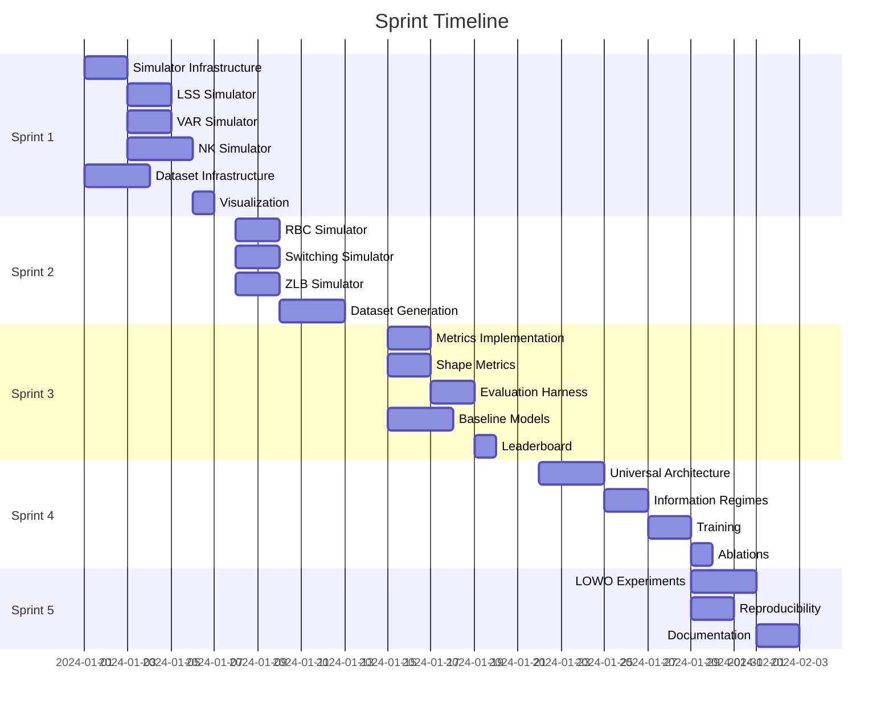

# Universal Macro Emulator Sprint Plan

**Version:** 1.0.0
**Status:** Active
**Last Updated:** 2025-12-23

---

## Overview

This document provides granular task breakdowns for each sprint. Each sprint follows a strict Definition of Done (DoD) before completion.

### Global Definition of Done

Every sprint must satisfy:
- [ ] All new code has unit tests (>80% coverage for new code)
- [ ] Deterministic seed replay validated
- [ ] At least one plot/artifact generated
- [ ] Relevant spec section updated if needed
- [ ] Reproducible command documented in CLAUDE.md
- [ ] CI passes (`pytest -m "fast"`)

### Effort Estimates

| Size | Description | Typical Duration |
|------|-------------|------------------|
| **S** | Small, well-defined task | < 2 hours |
| **M** | Medium complexity | 2-4 hours |
| **L** | Large, may need decomposition | 4-8 hours |
| **XL** | Very large, should be split | > 8 hours |

### Agent Assignments

| Agent | Responsibilities |
|-------|------------------|
| **Simulator Engineer** | Simulator adapters, solvers, tests |
| **Data Engineer** | Dataset generation, schemas, storage |
| **Model Engineer** | Emulator architecture, training |
| **Eval Engineer** | Metrics, evaluation harness, plots |
| **Infra/QA** | CI, testing infrastructure, review |

---

## Sprint 1: Foundation

**Duration:** Week 1
**Goal:** Adapter API + dataset schema + 3 simulators working

### Scope Boundaries

**In Scope:**
- SimulatorAdapter base class and protocol
- LSS, VAR, NK simulators with tests
- Zarr dataset writer + manifest schema
- IRF panel plot generator
- Basic CI pipeline

**Out of Scope:**
- RBC, Switching, ZLB simulators (Sprint 2)
- Training code (Sprint 3+)
- Evaluation metrics beyond basic plots

### Workstream: Simulator Infrastructure

| ID | Task | Owner | Effort | Dependencies | Acceptance Criteria |
|----|------|-------|--------|--------------|---------------------|
| S1.1 | Create `simulators/base.py` with `SimulatorAdapter` protocol | Simulator | M | - | Protocol matches spec §3.1; mypy passes |
| S1.2 | Create `ParameterManifest`, `ShockManifest`, `ObservableManifest` dataclasses | Simulator | S | - | All fields from spec; JSON serializable |
| S1.3 | Create `SimulatorOutput` dataclass | Simulator | S | - | Matches spec; includes regime_seq |
| S1.4 | Implement parameter normalization utilities | Simulator | M | S1.2 | `normalize_param`, `normalize_bounded` per spec §3.7 |
| S1.5 | Add `check_validity` base method | Simulator | S | S1.1 | Bounds + stability check interface |

### Workstream: LSS Simulator

| ID | Task | Owner | Effort | Dependencies | Acceptance Criteria |
|----|------|-------|--------|--------------|---------------------|
| S1.6 | Implement `LSSSimulator` class | Simulator | L | S1.1-S1.5 | Conforms to adapter protocol |
| S1.7 | Implement `sample_parameters` for LSS | Simulator | M | S1.6 | Stable A matrices (spectral radius < ρ_max) |
| S1.8 | Implement `simulate` for LSS | Simulator | M | S1.6 | Correct state-space dynamics |
| S1.9 | Implement `compute_irf` for LSS | Simulator | M | S1.6 | Matches analytical IRF |
| S1.10 | Implement `get_analytic_irf` for LSS | Simulator | M | S1.6 | Closed-form: C @ A^h @ B |
| S1.11 | Write `test_lss.py` unit tests | Simulator | M | S1.6-S1.10 | Analytic IRF match; stability; determinism |

### Workstream: VAR Simulator

| ID | Task | Owner | Effort | Dependencies | Acceptance Criteria |
|----|------|-------|--------|--------------|---------------------|
| S1.12 | Implement `VARSimulator` class | Simulator | L | S1.1-S1.5 | Conforms to adapter protocol |
| S1.13 | Implement stable VAR coefficient sampling | Simulator | M | S1.12 | Companion eigenvalues < ρ_max |
| S1.14 | Implement `simulate` for VAR | Simulator | M | S1.12 | Correct VAR(p) dynamics |
| S1.15 | Implement `compute_irf` for VAR | Simulator | M | S1.12 | Matches analytical IRF |
| S1.16 | Implement `get_analytic_irf` for VAR | Simulator | M | S1.12 | Via companion matrix powers |
| S1.17 | Write `test_var.py` unit tests | Simulator | M | S1.12-S1.16 | Analytic IRF match; stationarity |

### Workstream: NK Simulator

| ID | Task | Owner | Effort | Dependencies | Acceptance Criteria |
|----|------|-------|--------|--------------|---------------------|
| S1.18 | Implement `NKSimulator` class | Simulator | L | S1.1-S1.5 | Conforms to adapter protocol |
| S1.19 | Implement gensys-style RE solver | Simulator | L | - | Solves 3-eq NK; handles determinacy |
| S1.20 | Implement `sample_parameters` with determinacy filter | Simulator | M | S1.18, S1.19 | Rejects indeterminate draws |
| S1.21 | Implement `simulate` for NK | Simulator | M | S1.18, S1.19 | Correct NK dynamics |
| S1.22 | Implement `compute_irf` for NK | Simulator | M | S1.18, S1.19 | Correct IRF via state-space |
| S1.23 | Write `test_nk.py` unit tests | Simulator | M | S1.18-S1.22 | Determinacy; known IRF shapes |

### Workstream: Dataset Infrastructure

| ID | Task | Owner | Effort | Dependencies | Acceptance Criteria |
|----|------|-------|--------|--------------|---------------------|
| S1.24 | Create `data/schemas/manifest.json` JSON schema | Data | M | - | Validates spec §4.2 structure |
| S1.25 | Implement Zarr dataset writer | Data | L | S1.24 | Writes trajectories, irfs, shocks, theta |
| S1.26 | Implement manifest generator | Data | M | S1.24, S1.25 | Creates valid manifest.json |
| S1.27 | Write `test_data_pipeline.py` | Data | M | S1.25, S1.26 | Zarr integrity; manifest consistency |

### Workstream: Visualization

| ID | Task | Owner | Effort | Dependencies | Acceptance Criteria |
|----|------|-------|--------|--------------|---------------------|
| S1.28 | Implement IRF panel plot generator | Eval | M | S1.6-S1.23 | 3×N grid (output, inflation, rate) |
| S1.29 | Add plot styling and save functionality | Eval | S | S1.28 | PNG output; consistent style |

### Workstream: Infrastructure

| ID | Task | Owner | Effort | Dependencies | Acceptance Criteria |
|----|------|-------|--------|--------------|---------------------|
| S1.30 | Create `pyproject.toml` with dependencies | Infra | S | - | pip install -e . works |
| S1.31 | Create basic CI workflow | Infra | M | S1.30 | Lint + fast tests pass |
| S1.32 | Create initial CLAUDE.md | Infra | S | - | Build/test commands documented |

### Sprint 1 Command Checklist

```bash
# Must all pass before sprint completion
ruff check .
mypy simulators/ --ignore-missing-imports
pytest simulators/tests/ -m "fast" -v
pytest data/tests/ -m "fast" -v

# Must generate artifacts
python -c "from simulators.lss import LSSSimulator; s = LSSSimulator(); print(s.world_id)"
python -c "from simulators.var import VARSimulator; s = VARSimulator(); print(s.world_id)"
python -c "from simulators.nk import NKSimulator; s = NKSimulator(); print(s.world_id)"

# Must produce IRF panel
python -m emulator.eval.plots --simulators lss,var,nk --output sprint1_irf_panel.png
```

### Sprint 1 Risks & Mitigations

| Risk | Likelihood | Impact | Mitigation |
|------|------------|--------|------------|
| NK solver determinacy issues | Medium | High | Use well-tested gensys implementation; extensive unit tests |
| VAR stability sampling slow | Low | Medium | Use eigenvalue placement instead of rejection sampling |
| Zarr performance issues | Low | Low | Start with small test datasets; profile if needed |

### Sprint 1 Exit Artifact

- [ ] IRF panels for LSS, VAR, NK (3 simulators)
- [ ] Deterministic data generation verified
- [ ] All tests passing

---

## Sprint 2: Simulator Bank

**Duration:** Week 2
**Goal:** Complete simulator bank + scale dataset generation

### Scope Boundaries

**In Scope:**
- RBC, Switching, ZLB simulators with tests
- Dataset generation script (100k samples/world)
- Parameter extrapolation holdout logic
- Dataset versioning and manifest finalization

**Out of Scope:**
- Training code
- Baselines
- Evaluation metrics

### Workstream: RBC Simulator

| ID | Task | Owner | Effort | Dependencies | Acceptance Criteria |
|----|------|-------|--------|--------------|---------------------|
| S2.1 | Implement `RBCSimulator` class | Simulator | L | Sprint 1 | Conforms to adapter protocol |
| S2.2 | Implement RBC steady-state solver | Simulator | M | S2.1 | Correct steady state |
| S2.3 | Implement RBC linearization | Simulator | M | S2.1, S2.2 | State-space representation |
| S2.4 | Implement `sample_parameters` with stability filter | Simulator | M | S2.1-S2.3 | Saddle-path stability |
| S2.5 | Write `test_rbc.py` unit tests | Simulator | M | S2.1-S2.4 | Stability; IRF shapes |

### Workstream: Regime-Switching Simulator

| ID | Task | Owner | Effort | Dependencies | Acceptance Criteria |
|----|------|-------|--------|--------------|---------------------|
| S2.6 | Implement `SwitchingSimulator` class | Simulator | L | Sprint 1 | Conforms to adapter protocol |
| S2.7 | Implement Markov regime transition logic | Simulator | M | S2.6 | Correct transition probabilities |
| S2.8 | Implement regime-dependent dynamics | Simulator | M | S2.6, S2.7 | Switches between A_0, A_1 |
| S2.9 | Implement `sample_parameters` for switching | Simulator | M | S2.6-S2.8 | Valid transition matrix |
| S2.10 | Write `test_switching.py` unit tests | Simulator | M | S2.6-S2.9 | Regime durations; stability |

### Workstream: ZLB Toy Simulator

| ID | Task | Owner | Effort | Dependencies | Acceptance Criteria |
|----|------|-------|--------|--------------|---------------------|
| S2.11 | Implement `ZLBSimulator` class (extends NK) | Simulator | M | Sprint 1 NK | Conforms to adapter protocol |
| S2.12 | Implement ZLB constraint application | Simulator | M | S2.11 | `r = max(r_unconstrained, 0)` |
| S2.13 | Track `binding_fraction` in metadata | Simulator | S | S2.11, S2.12 | Stored in SimulatorOutput |
| S2.14 | Write `test_zlb.py` unit tests | Simulator | M | S2.11-S2.13 | Constraint binds correctly |

### Workstream: Dataset Generation

| ID | Task | Owner | Effort | Dependencies | Acceptance Criteria |
|----|------|-------|--------|--------------|---------------------|
| S2.15 | Implement `generate_dataset.py` CLI | Data | L | Sprint 1 | `--world`, `--n_samples`, `--seed` args |
| S2.16 | Add parallel generation support | Data | M | S2.15 | Multiprocessing for speed |
| S2.17 | Implement split construction algorithms | Data | L | S2.15 | Interpolation, slice, corner per spec §4.6 |
| S2.18 | Add slice predicates per simulator | Data | M | S2.17 | Per-world predicates from spec |
| S2.19 | Implement dataset versioning | Data | M | S2.15 | Git hash + config hash in manifest |
| S2.20 | Write `test_splits.py` | Data | M | S2.17, S2.18 | Disjointness; correct fractions |

### Workstream: Validation

| ID | Task | Owner | Effort | Dependencies | Acceptance Criteria |
|----|------|-------|--------|--------------|---------------------|
| S2.21 | Implement `validate_dataset.py` | Data | M | S2.15-S2.19 | Checks Zarr integrity, manifest |
| S2.22 | Add sanity plot generation | Eval | M | S2.21 | Histograms, sample IRFs |

### Sprint 2 Command Checklist

```bash
# Must all pass
pytest simulators/tests/ -m "fast" -v
pytest data/tests/ -m "fast" -v

# Generate full dataset (dev size)
python -m data.scripts.generate_dataset --world all --n_samples 10000 --seed 42 --output datasets/v1.0-dev/

# Validate dataset
python -m data.scripts.validate_dataset --path datasets/v1.0-dev/

# Generate sanity plots
python -m emulator.eval.plots --dataset datasets/v1.0-dev/ --output sprint2_sanity.png
```

### Sprint 2 Risks & Mitigations

| Risk | Likelihood | Impact | Mitigation |
|------|------------|--------|------------|
| RBC linearization errors | Medium | High | Compare to Dynare output for known parameters |
| Switching regime inference hard | Low | Medium | Not required for Phase 1; assist flag available |
| Dataset generation slow | Medium | Medium | Profile early; use parallel generation |

### Sprint 2 Exit Artifact

- [ ] All 6 simulators implemented and tested
- [ ] Dataset manifest with all worlds (10k dev samples each)
- [ ] Sanity plots showing IRF diversity

---

## Sprint 3: Baselines + Evaluation

**Duration:** Week 3
**Goal:** Evaluation harness + baseline models

### Scope Boundaries

**In Scope:**
- Full evaluation harness with all metrics
- Shape metrics (HF-ratio, overshoot, sign-flip)
- Oracle, per-world MLP, per-world GRU, linear baselines
- Baseline leaderboard table generator

**Out of Scope:**
- Universal emulator
- Information regimes
- Ablations

### Workstream: Metrics Implementation

| ID | Task | Owner | Effort | Dependencies | Acceptance Criteria |
|----|------|-------|--------|--------------|---------------------|
| S3.1 | Implement `metrics.py` with NRMSE | Eval | M | - | Matches spec §7.2.1 formula |
| S3.2 | Implement horizon weighting schemes | Eval | S | S3.1 | Uniform, exponential, impact-weighted |
| S3.3 | Implement sign-at-impact accuracy | Eval | S | - | Correct for h=0..2 |
| S3.4 | Implement IAE (Integrated Absolute Error) | Eval | S | - | Sum over horizons |
| S3.5 | Implement Gap metric | Eval | S | S3.1 | Universal vs specialist comparison |

### Workstream: Shape Metrics

| ID | Task | Owner | Effort | Dependencies | Acceptance Criteria |
|----|------|-------|--------|--------------|---------------------|
| S3.6 | Implement HF-ratio via DFT | Eval | M | - | Correct frequency cutoff (period < 6-8) |
| S3.7 | Implement overshoot ratio | Eval | S | - | max|y[h]| / (|y[0]| + ε) |
| S3.8 | Implement sign-flip count | Eval | S | - | Count sign changes in Δy |
| S3.9 | Write `test_shape_metrics.py` | Eval | M | S3.6-S3.8 | Known inputs → known outputs |

### Workstream: Evaluation Harness

| ID | Task | Owner | Effort | Dependencies | Acceptance Criteria |
|----|------|-------|--------|--------------|---------------------|
| S3.10 | Implement `evaluate.py` CLI | Eval | L | S3.1-S3.8 | `--checkpoint`, `--dataset`, `--output` |
| S3.11 | Add per-world metric breakdown | Eval | M | S3.10 | Separate metrics per simulator |
| S3.12 | Add per-split metric breakdown | Eval | M | S3.10 | Interpolation vs extrapolation |
| S3.13 | Generate metric tables (CSV/JSON) | Eval | M | S3.10-S3.12 | Matches spec §7.5 |
| S3.14 | Generate IRF panel plots | Eval | M | S3.10 | 3×6 grid with ground truth overlay |
| S3.15 | Generate shape diagnostic plots | Eval | M | S3.10 | HF spectrum, overshoot distribution |

### Workstream: Baseline Models

| ID | Task | Owner | Effort | Dependencies | Acceptance Criteria |
|----|------|-------|--------|--------------|---------------------|
| S3.16 | Implement Oracle baseline (analytic IRF) | Model | M | Sprint 1-2 | Uses `get_analytic_irf` |
| S3.17 | Implement Linear regression baseline | Model | M | - | Features → IRF direct |
| S3.18 | Implement per-world MLP baseline | Model | L | - | One MLP per simulator |
| S3.19 | Implement per-world GRU baseline | Model | L | - | Sequence model per simulator |
| S3.20 | Implement pooled MLP baseline | Model | M | S3.18 | Single MLP, world_id as input |
| S3.21 | Write `test_baselines.py` | Model | M | S3.16-S3.20 | Forward pass works; shapes correct |

### Workstream: Training Infrastructure

| ID | Task | Owner | Effort | Dependencies | Acceptance Criteria |
|----|------|-------|--------|--------------|---------------------|
| S3.22 | Implement `trainer.py` base class | Model | L | - | Training loop, checkpointing |
| S3.23 | Implement DataLoader for Zarr datasets | Data | M | Sprint 2 | Efficient loading; shuffling |
| S3.24 | Add training config YAML support | Model | M | S3.22 | Loads configs per spec §5.5.5 |
| S3.25 | Add early stopping | Model | S | S3.22 | Patience-based on val metric |
| S3.26 | Add learning rate scheduling | Model | S | S3.22 | Cosine with warmup |

### Workstream: Leaderboard

| ID | Task | Owner | Effort | Dependencies | Acceptance Criteria |
|----|------|-------|--------|--------------|---------------------|
| S3.27 | Implement leaderboard generator | Eval | M | S3.10-S3.15 | Markdown table output |
| S3.28 | Train and evaluate all baselines | Model | L | S3.16-S3.26 | Results for all 5 baselines |

### Sprint 3 Command Checklist

```bash
# Must all pass
pytest emulator/tests/ -m "fast" -v

# Train baselines (smoke test)
python -m emulator.training.trainer --config configs/baseline_mlp.yaml --max_epochs 10

# Evaluate baselines
python -m emulator.eval.evaluate --checkpoint runs/baseline_mlp/checkpoint.pt --dataset datasets/v1.0-dev/

# Generate leaderboard
python -m emulator.eval.leaderboard --runs runs/ --output sprint3_leaderboard.md
```

### Sprint 3 Risks & Mitigations

| Risk | Likelihood | Impact | Mitigation |
|------|------------|--------|------------|
| GRU training unstable | Medium | Medium | Gradient clipping; careful initialization |
| DataLoader bottleneck | Low | Medium | Profile early; prefetching |
| Baselines overfit on small data | Medium | Low | Use dev set for smoke tests only |

### Sprint 3 Exit Artifact

- [ ] Baseline leaderboard table
- [ ] IRF dashboards for all baselines
- [ ] Shape diagnostic plots

---

## Sprint 4: Universal Emulator

**Duration:** Week 4
**Goal:** Universal emulator v1 + information regimes + ablations

### Scope Boundaries

**In Scope:**
- Universal emulator architecture
- Parameter token encoding
- Information regimes A, B1, C
- Training on all 6 simulators
- Ablation suite (no world_id, no theta, no eps)
- Main result figures

**Out of Scope:**
- LOWO experiments (Sprint 5)
- Regime B2 (Phase 2)
- Uncertainty quantification (Phase 2)

### Workstream: Universal Emulator Architecture

| ID | Task | Owner | Effort | Dependencies | Acceptance Criteria |
|----|------|-------|--------|--------------|---------------------|
| S4.1 | Implement world embedding layer | Model | M | - | Learnable embedding per world_id |
| S4.2 | Implement parameter token encoder | Model | L | - | Per spec §5.4; set transformer or pooling |
| S4.3 | Implement shock token encoder | Model | M | - | Embeds (shock_idx, size, timing) |
| S4.4 | Implement history encoder (optional) | Model | L | - | Transformer/GRU for y[0:k] |
| S4.5 | Implement trunk (Transformer/MLP) | Model | L | S4.1-S4.4 | Combines all embeddings |
| S4.6 | Implement IRF head | Model | M | S4.5 | Direct prediction (H+1, 3) |
| S4.7 | Implement trajectory head (optional) | Model | M | S4.5 | Direct prediction (T, 3) |
| S4.8 | Write `test_universal.py` | Model | M | S4.1-S4.7 | Forward pass; gradient flow |

### Workstream: Information Regimes

| ID | Task | Owner | Effort | Dependencies | Acceptance Criteria |
|----|------|-------|--------|--------------|---------------------|
| S4.9 | Implement ShockToken dataclass | Model | S | - | Per spec §6.1 |
| S4.10 | Implement regime-aware input masking | Model | M | S4.1-S4.7, S4.9 | Correctly masks theta, eps, history |
| S4.11 | Add regime flag to training config | Model | S | S4.10 | `regime: A | B1 | C` |
| S4.12 | Implement regime A training | Model | M | S4.10, S4.11 | All inputs available |
| S4.13 | Implement regime B1 training | Model | M | S4.10, S4.11 | Only world_id, shock_token, history |
| S4.14 | Implement regime C training | Model | M | S4.10, S4.11 | world_id, theta, shock_token, history |

### Workstream: Training

| ID | Task | Owner | Effort | Dependencies | Acceptance Criteria |
|----|------|-------|--------|--------------|---------------------|
| S4.15 | Implement multi-horizon loss | Model | M | - | Per spec §5.5.1 |
| S4.16 | Add horizon weighting to loss | Model | S | S4.15 | Configurable w[h] |
| S4.17 | Add optional smoothness regularization | Model | S | S4.15 | λ_smooth * Δ²ŷ penalty |
| S4.18 | Create universal emulator config | Model | M | S4.1-S4.17 | YAML with all hyperparams |
| S4.19 | Train universal emulator (all regimes) | Model | XL | S4.1-S4.18 | One model per regime |

### Workstream: Ablations

| ID | Task | Owner | Effort | Dependencies | Acceptance Criteria |
|----|------|-------|--------|--------------|---------------------|
| S4.20 | Implement ablation configs | Model | M | S4.18 | Remove world_id, theta, eps separately |
| S4.21 | Train ablation models | Model | L | S4.20 | 3 ablation models per regime |
| S4.22 | Generate ablation summary table | Eval | M | S4.21 | Delta metrics vs full model |

### Workstream: Results

| ID | Task | Owner | Effort | Dependencies | Acceptance Criteria |
|----|------|-------|--------|--------------|---------------------|
| S4.23 | Generate main accuracy figures | Eval | M | S4.19 | NRMSE bar charts per world |
| S4.24 | Generate shape comparison figures | Eval | M | S4.19 | HF-ratio, overshoot vs baselines |
| S4.25 | Generate regime comparison figures | Eval | M | S4.19 | A vs B1 vs C performance |
| S4.26 | Update leaderboard with universal | Eval | S | S4.19-S4.25 | Add universal to table |

### Sprint 4 Command Checklist

```bash
# Must all pass
pytest emulator/tests/ -m "fast" -v

# Train universal emulator (all regimes)
python -m emulator.training.trainer --config configs/universal_regime_A.yaml
python -m emulator.training.trainer --config configs/universal_regime_B1.yaml
python -m emulator.training.trainer --config configs/universal_regime_C.yaml

# Run ablations
python -m emulator.training.trainer --config configs/ablation_no_world_id.yaml
python -m emulator.training.trainer --config configs/ablation_no_theta.yaml
python -m emulator.training.trainer --config configs/ablation_no_eps.yaml

# Evaluate all
python -m emulator.eval.evaluate --checkpoint runs/universal_A/checkpoint.pt --dataset datasets/v1.0/
python -m emulator.eval.ablation_summary --runs runs/ --output sprint4_ablations.md

# Generate figures
python -m emulator.eval.figures --runs runs/ --output figures/
```

### Sprint 4 Risks & Mitigations

| Risk | Likelihood | Impact | Mitigation |
|------|------------|--------|------------|
| Universal underperforms specialists | Medium | High | Check capacity; add per-world experts if needed |
| Parameter tokens don't generalize | Medium | Medium | Try alternative encodings (MLP, attention) |
| Training unstable across worlds | Low | High | Per-world loss weighting; gradient monitoring |

### Sprint 4 Exit Artifact

- [ ] Main accuracy figures (NRMSE per world)
- [ ] Shape comparison figures
- [ ] Ablation summary table
- [ ] Updated leaderboard

---

## Sprint 5: Transfer + Polish

**Duration:** Week 5
**Goal:** LOWO experiments + reproducibility + documentation

### Scope Boundaries

**In Scope:**
- Leave-One-World-Out training/evaluation
- One-command reproduction script
- CLAUDE.md with all commands
- README with setup instructions
- Final metric tables and figures
- Config archive for all runs

**Out of Scope:**
- New model architectures
- Phase 2 features

### Workstream: LOWO Experiments

| ID | Task | Owner | Effort | Dependencies | Acceptance Criteria |
|----|------|-------|--------|--------------|---------------------|
| S5.1 | Implement LOWO data split | Data | M | Sprint 2 | Exclude one world from training |
| S5.2 | Create LOWO training configs | Model | M | S5.1 | 6 configs (one per held-out world) |
| S5.3 | Train LOWO models | Model | XL | S5.2 | 6 models trained |
| S5.4 | Evaluate LOWO transfer | Eval | L | S5.3 | Metrics on held-out world |
| S5.5 | Generate LOWO comparison figures | Eval | M | S5.4 | Transfer vs in-domain performance |

### Workstream: Reproducibility

| ID | Task | Owner | Effort | Dependencies | Acceptance Criteria |
|----|------|-------|--------|--------------|---------------------|
| S5.6 | Create `run.sh` reproduction script | Infra | L | All sprints | Single command reproduces all results |
| S5.7 | Archive all experiment configs | Infra | M | S5.6 | `experiments/configs/archive/` |
| S5.8 | Verify reproduction on clean environment | Infra | L | S5.6, S5.7 | Fresh clone → same results |
| S5.9 | Document random seeds | Infra | S | S5.6 | All seeds in config/manifest |

### Workstream: Documentation

| ID | Task | Owner | Effort | Dependencies | Acceptance Criteria |
|----|------|-------|--------|--------------|---------------------|
| S5.10 | Write comprehensive CLAUDE.md | Infra | L | All sprints | All commands documented |
| S5.11 | Write README.md | Infra | M | - | Setup, usage, reproduction |
| S5.12 | Document all configs | Infra | M | - | Comments in YAML files |
| S5.13 | Create results summary document | Eval | M | All sprints | Main findings, figures |

### Workstream: Final Results

| ID | Task | Owner | Effort | Dependencies | Acceptance Criteria |
|----|------|-------|--------|--------------|---------------------|
| S5.14 | Generate final metric tables | Eval | M | All sprints | CSV + markdown |
| S5.15 | Generate final figure set | Eval | M | All sprints | Publication-quality |
| S5.16 | Run full statistical tests | QA | L | All sprints | Nightly test suite passes |
| S5.17 | Final review and cleanup | QA | M | S5.14-S5.16 | Code quality check |

### Sprint 5 Command Checklist

```bash
# LOWO training
for world in lss var nk rbc switching zlb; do
    python -m emulator.training.trainer --config configs/lowo_exclude_${world}.yaml
done

# Full reproduction test
./run.sh reproduce

# Verify results match
python -m emulator.eval.verify_reproduction --expected results/expected.json --actual results/actual.json

# Generate final outputs
python -m emulator.eval.final_report --output results/final/
```

### Sprint 5 Risks & Mitigations

| Risk | Likelihood | Impact | Mitigation |
|------|------------|--------|------------|
| LOWO transfer poor | Medium | Medium | Expected for very different worlds; document |
| Reproduction fails on different hardware | Low | High | Document hardware; use fixed seeds |
| Missing documentation | Medium | Medium | Documentation checklist in DoD |

### Sprint 5 Exit Artifact

- [ ] LOWO transfer results
- [ ] `./run.sh reproduce` works from clean clone
- [ ] Complete CLAUDE.md and README.md
- [ ] Final metric tables and figures

---

## Post-Sprint Checklist

After all sprints, verify:

### Success Criteria (from spec §7.2.3)

- [ ] Universal beats baselines on all worlds
- [ ] Mean gap ≤ 20%
- [ ] Max gap ≤ 35%
- [ ] Shape preservation: HF-ratio ≤ 1.1× specialist

### Artifacts

- [ ] All 6 simulators with tests
- [ ] Dataset (100k+ samples/world) with manifest
- [ ] Trained models: baselines, universal (3 regimes), ablations, LOWO
- [ ] Evaluation: metrics, figures, leaderboard
- [ ] Documentation: spec, sprint-plan, CLAUDE.md, README

### Reproducibility

- [ ] `./run.sh reproduce` completes successfully
- [ ] Results match expected within tolerance
- [ ] All random seeds documented

---

## Appendix: Task Dependencies (Mermaid)



---

*End of Sprint Plan*
